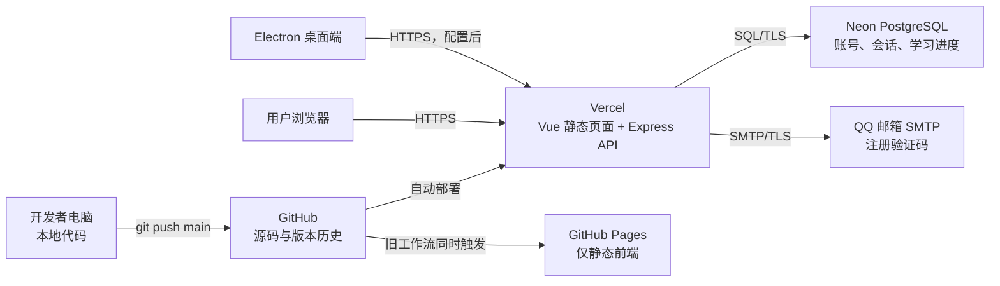
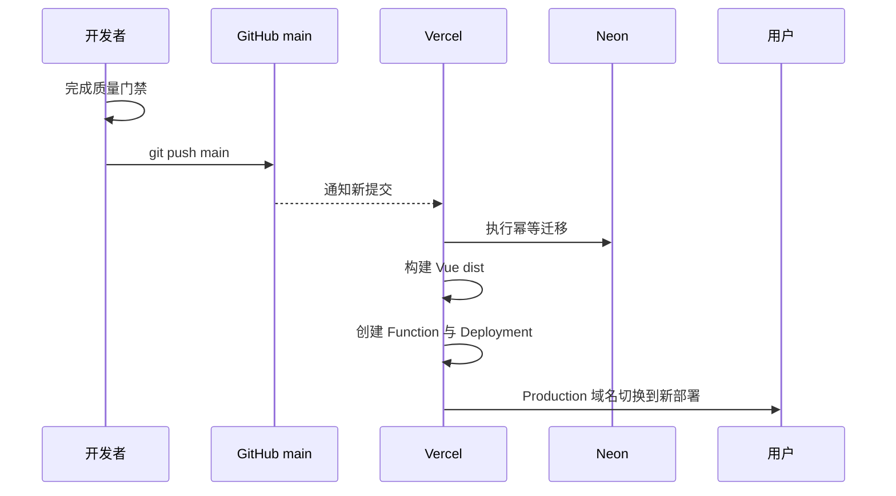

# 云栈部署架构与线上服务学习指南

> 更新日期：2026-07-14
>
> 核对范围：`main` 分支、Vercel、Neon、GitHub Pages、Render 备用配置、QQ SMTP、Electron
>
> 安全说明：本文只记录变量名称和管理入口，不记录数据库密码、SMTP 授权码、Cookie、Token 或验证码。

## 1. 先记住最终结论

云栈当前的正式在线架构不是“一个网页”，而是多个平台共同完成一套系统：

| 组成 | 当前职责 | 当前状态 | 能否发给普通用户 |
| --- | --- | --- | --- |
| GitHub 仓库 | 保存源码、版本历史和自动化工作流 | 正在使用，仓库公开 | 可以发，但这是代码，不是正式网站 |
| Vercel | 提供正式网页、静态资源和 Node.js API | 正式生产环境 | 可以，只发 Production 域名 |
| Neon | 提供 PostgreSQL 云数据库 | 正式生产数据库 | 不可以，这是管理后台 |
| QQ 邮箱 SMTP | 发送注册验证码 | 正式邮件通道 | 不可以，不存在给用户访问的页面 |
| GitHub Pages | 额外发布静态前端 | 历史/重复入口 | 不建议发，账号 API 无法独立运行 |
| Render | 常驻 Node.js 服务的备用方案 | 仅保留配置，未确认在使用 | 不建议发 |
| Electron | Windows 桌面软件和本地进度文件 | 本地交付渠道 | 安装包可以发，云端 API 尚需配置 |
| 本地 Vite | 开发和调试网页 | 仅本机开发 | 不可以发给互联网用户 |

当前应当对外分享的唯一正式网址是：

- 网站首页：<https://yunzhan.vercel.app>
- 登录页面：<https://yunzhan.vercel.app/#/login>

不要把下面这类带随机字符的网址发给普通用户：

```text
https://yunzhan-某段随机字符-cruise1.vercel.app
```

它是某一次构建的唯一部署地址，可能受 Vercel Deployment Protection 保护并跳转到 Vercel 登录页。正式域名 `yunzhan.vercel.app` 会始终指向当前 Production 部署。

## 2. 整体架构图



理解这张图时，要区分三类东西：

1. **代码仓库**：GitHub 保存“程序怎么写”。
2. **运行平台**：Vercel 真正运行网页和 API。
3. **数据服务**：Neon 保存用户数据，QQ SMTP 发送邮件。

任何一个关键服务不可用，都会出现不同故障：

- GitHub 不可用：暂时无法更新代码，但已上线网站通常还能运行。
- Vercel 不可用：网页和 API 都无法访问。
- Neon 不可用：首页静态资源可能打开，但登录、注册、进度和超管功能失败。
- QQ SMTP 不可用：已有用户可能仍能登录，但新用户收不到验证码。

## 3. 每个网页和控制台分别做什么

### 3.1 GitHub 仓库

地址：<https://github.com/CruiseTom001/yunzhan>

作用：

- 保存 Vue、TypeScript、Express、Electron 和课程数据源码。
- 保存每次提交记录，出现问题时可以比较版本或回滚代码。
- `main` 是当前生产分支。
- Vercel 监听这个仓库，`main` 更新后自动创建 Production 部署。
- GitHub Actions 也监听 `main`，当前仍会尝试发布 GitHub Pages。

常用页面：

| 页面 | 地址 | 用途 |
| --- | --- | --- |
| 代码 | <https://github.com/CruiseTom001/yunzhan> | 查看当前源码和提交 |
| Actions | <https://github.com/CruiseTom001/yunzhan/actions> | 查看 GitHub Pages 构建成功或失败 |
| Pages 设置 | <https://github.com/CruiseTom001/yunzhan/settings/pages> | 查看 GitHub Pages 发布来源 |
| 仓库设置 | <https://github.com/CruiseTom001/yunzhan/settings> | 修改仓库可见性、协作者等 |

当前仓库是公开仓库。这意味着任何人都可以看到源码，但看不到正确保存在 Vercel/Neon 后台的私密环境变量。

仓库中的 `.gitignore` 已忽略 `.env`、`.env.*`、`dist/` 和 `release/`。不要因为文件被忽略就降低警惕：任何密码、连接串或授权码都不应粘贴进源码、提交信息、Issue 或 Actions 日志。

### 3.2 GitHub Actions 与 GitHub Pages

工作流文件：`.github/workflows/deploy.yml`

它在每次推送 `main` 时执行：

1. 下载源码。
2. 安装 Node.js 22。
3. 执行 `npm ci`。
4. 执行 `npm run build`。
5. 上传 `dist/`。
6. 发布到 GitHub Pages。

GitHub Pages 只能提供构建后的静态文件。它不能独立运行本项目的 Express API、数据库迁移、PostgreSQL 和 SMTP 邮件发送。因此即使页面能打开，下面的功能也不能只靠 Pages 完成：

- 邮箱验证码注册。
- 登录和退出。
- 云端学习进度同步。
- 超管用户管理。
- Neon 数据库读写。

标准的历史 Pages 地址是：

```text
https://cruisetom001.github.io/yunzhan/
```

本次核对确认仓库仍包含 Pages 工作流，但未把该地址认定为正式入口。它会和 Vercel 重复构建，也可能继续产生“Deploy to GitHub Pages failed”邮件。

**建议状态**：Vercel 稳定后，停用或删除 Pages 工作流，避免用户误入静态旧版本。执行前应先确认是否还需要保留纯静态演示版。

### 3.3 Vercel 项目

项目控制台：<https://vercel.com/cruise1/yunzhan>

正式域名：<https://yunzhan.vercel.app>

Vercel 在当前架构中同时承担两项职责：

1. 托管 Vue/Vite 构建出的 `dist/` 静态文件。
2. 通过 Vercel Function 运行 `api/index.mjs`，再加载 Express 应用 `server/index.mjs`。

项目配置 `vercel.json` 的核心含义：

```json
{
  "buildCommand": "npm run vercel:build",
  "outputDirectory": "dist",
  "rewrites": [
    { "source": "/api/:path*", "destination": "/api" },
    { "source": "/(.*)", "destination": "/index.html" }
  ]
}
```

- `/api/...` 请求交给 Vercel Function。
- 其他路径返回 Vue 的 `index.html`。
- 前端使用 Hash 路由，所以地址里会出现 `#/login`、`#/courses`、`#/admin/users`。
- `#` 后面的内容由浏览器端 Vue Router 处理，不会被当成服务器文件路径。

Vercel 构建命令实际执行：

```text
npm run vercel:build
  -> npm run server:migrate
  -> npm run build
```

也就是说，每次生产构建会先对 Neon 执行幂等迁移，再构建前端。迁移脚本必须保持可重复执行，不能依赖人工顺序或破坏旧数据。

Vercel 常用页面：

| 页面 | 作用 | 出问题时看什么 |
| --- | --- | --- |
| Overview | 查看最近一次部署和正式域名 | 是否显示 Production |
| Deployments | 查看每次构建记录和唯一部署 URL | Build 是否成功、哪个提交上线 |
| Logs | 查看 Function/API 运行日志 | 500、SMTP、数据库连接错误 |
| Environment Variables | 管理生产私密变量 | 变量是否缺失、环境范围是否正确 |
| Domains | 管理 `yunzhan.vercel.app` 或自定义域名 | 是否显示 Valid Configuration、Production |
| Deployment Protection | 控制预览/部署地址访问权限 | 为什么跳到 Vercel 登录页 |
| Settings/Git | 查看关联仓库和生产分支 | 是否关联 `main` |

需要在 Vercel 保存但不得进入 Git 的变量包括：

```text
DATABASE_URL
NODE_ENV
DB_SSL
DB_POOL_SIZE
COOKIE_SECURE
COOKIE_SAME_SITE
TRUST_PROXY
SERVE_STATIC
ALLOW_ELECTRON_FILE_ORIGIN
EMAIL_CODE_SECRET
SMTP_HOST
SMTP_PORT
SMTP_SECURE
SMTP_USER
SMTP_PASSWORD
SMTP_FROM
```

其中：

- `DATABASE_URL` 连接 Neon，应该使用 pooled connection string。
- `EMAIL_CODE_SECRET` 用于计算验证码和请求 IP 的 HMAC 摘要。
- `SMTP_PASSWORD` 是 QQ 邮箱客户端授权码，不是网页登录密码。
- `COOKIE_SECURE=true` 确保登录 Cookie 只通过 HTTPS 发送。
- `COOKIE_SAME_SITE=lax` 适合网页与 API 同域部署。

修改环境变量后，通常需要重新部署，新的 Function 才会读取新值。

### 3.4 Vercel 的三种网址

| 类型 | 示例 | 用途 | 是否适合分享 |
| --- | --- | --- | --- |
| Production 域名 | `yunzhan.vercel.app` | 永远指向当前正式版本 | 是 |
| 唯一部署地址 | `yunzhan-随机字符-cruise1.vercel.app` | 定位某一次构建 | 否，可能受保护 |
| Preview 地址 | 非 `main` 分支生成的地址 | 上线前测试 | 只发给测试人员 |

如果访问唯一部署地址后出现“Log in to Vercel”，这是 Vercel Authentication，不是云栈登录页。普通用户应改用 Production 域名。

### 3.5 Neon PostgreSQL

项目控制台：<https://console.neon.tech>（登录后选择云栈当前使用的项目）

当前生产层级：

```text
Neon Project
└── production branch
    └── Primary compute
        └── neondb database
```

这些名词的区别：

- **Project**：Neon 中的整个数据库项目。
- **Branch**：数据库分支。当前线上使用 `production`。
- **Compute**：运行 PostgreSQL 查询的计算节点。控制台中可能显示 Idle，收到连接时会唤醒。
- **Database**：真正包含表、索引和数据的数据库，当前名为 `neondb`。
- **Role**：数据库用户名及权限身份。
- **Connection string**：应用连接数据库所需的完整地址，属于最高敏感信息之一。

Vercel Function 会弹性创建实例，因此应使用 Neon 的 pooled connection string。池化地址的主机名包含 `-pooler`，可以减少大量短生命周期函数对 PostgreSQL 直接连接数的压力。

当前数据库表：

| 表名 | 保存内容 | 关键安全点 |
| --- | --- | --- |
| `users` | 用户名、邮箱、显示名、角色、状态、密码哈希 | 不保存明文密码 |
| `sessions` | 登录会话 Token 的 SHA-256 摘要和过期时间 | 浏览器只持有 HttpOnly Cookie |
| `user_progress` | 每个账号当前学习进度 JSON 和版本号 | 使用乐观版本控制防止覆盖 |
| `progress_backups` | 每个账号最近的历史进度 | 当前保留最近 20 个版本 |
| `audit_logs` | 注册、登录和超管操作审计 | 用于追踪管理操作 |
| `deleted_user_backups` | 删除账号前的用户和进度快照 | 先备份再删除 |
| `email_verification_challenges` | 验证码摘要、发送状态、次数和过期时间 | 不保存验证码明文 |

Neon SQL Editor 可以直接修改生产数据，风险高于云栈超管页面。使用原则：

1. 先确认左侧是 `production`，数据库是 `neondb`。
2. 修改前先用 `SELECT` 精确查询目标。
3. `UPDATE` 和 `DELETE` 必须使用唯一条件。
4. 使用 `RETURNING` 核对实际影响行。
5. 返回 `0 rows` 时停止，不要扩大条件猜测。
6. 不在生产分支试验建表、删表或批量数据脚本。

推荐后续创建独立 `dev` 数据库分支，用于迁移和 SQL 练习，避免直接在 `production` 做实验。

### 3.6 QQ 邮箱 SMTP

QQ SMTP 没有独立的“云栈管理网页”。它是 Vercel API 调用的外部邮件通道：

```text
用户填写邮箱
  -> POST /api/auth/register/code
  -> Vercel 校验频率和邮箱
  -> 数据库保存验证码 HMAC 摘要
  -> Vercel 通过 smtp.qq.com 发送邮件
  -> 用户收到 6 位验证码
```

当前代码中的保护规则：

- 验证码有效期 10 分钟。
- 同一邮箱 60 秒内不能重复发送。
- 同一邮箱每小时最多 5 次。
- 同一 IP 每小时最多 20 次。
- 单个验证码最多尝试 5 次。
- 邮件连接和发送超时为 10 秒。
- SMTP 最低 TLS 版本为 1.2。

QQ 邮箱授权码只应存在 Vercel 环境变量 `SMTP_PASSWORD` 中。不要把授权码写进 `.env.example`、截图、聊天记录或 GitHub。

个人 QQ SMTP 适合当前小规模测试。用户量增长后，应改用带自有域名的事务邮件服务，以获得更清晰的额度、退信、送达率和反滥用管理。

### 3.7 Render

仓库中的 `render.yaml` 表示项目曾准备过 Render 备用部署：

- Node 服务名：`yunzhan-cruisetom001`。
- 区域：Singapore。
- 构建前端后，以常驻 Express 服务同时提供页面和 API。
- 数据库仍计划连接外部 PostgreSQL。

但是，配置文件本身不等于已经部署。本次核对没有把 Render 认定为当前正式生产环境。

另外，当前 `render.yaml` 仍包含旧的 `RESEND_API_KEY`、`RESEND_FROM_EMAIL` 变量，而现有代码已改为 QQ SMTP。因此它是**过时的备用配置**，不能不经修改就直接部署。

### 3.8 本地开发环境

本地开发使用两个进程：

```text
Vite 前端：http://127.0.0.1:5173
Express API：http://127.0.0.1:8787
```

Vite 会把 `/api` 代理到 Express。开发时常用：

```powershell
# 终端 1
npm run server:dev

# 终端 2
npm run dev
```

本地数据库可以通过 `docker-compose.yml` 启动 PostgreSQL 16：

```powershell
docker compose up -d postgres
npm run server:migrate
```

本地地址只能供当前电脑或局域网调试，不是互联网部署地址。关闭开发进程后，`127.0.0.1:5173` 就不能访问。

### 3.9 Electron 桌面端

Electron 安装包把 `dist/` 打包进桌面软件，不依赖浏览器打开网页。它有两层进度保护：

1. 账号隔离的本地进度文件。
2. 配置云端 API 后，继续和 Neon 中的账号进度同步。

本地数据位于 Electron 的 `userData` 目录，每个账号使用独立子目录，并维护：

```text
progress.json
progress.backup.json
```

写入采用临时文件后重命名，并在覆盖前刷新备份。安装包配置保持：

- `appId = com.yunzhan.app`
- 卸载时不自动删除 `userData`
- `contextIsolation = true`
- `nodeIntegration = false`
- `sandbox = true`

当前 `electron/api-config.json` 的 `apiOrigin` 为空。因此当前源码构建的新桌面安装包尚未绑定正式云端账号服务。发布下一版安装包前应改为：

```json
{
  "apiOrigin": "https://yunzhan.vercel.app"
}
```

同时，服务端需要允许 Electron 的 `file://` 来源。完成配置和测试后再执行正式安装包构建。

## 4. 五条核心业务数据流

### 4.1 用户打开网页

```text
浏览器
  -> yunzhan.vercel.app
  -> Vercel CDN 返回 index.html、JavaScript 和 CSS
  -> Vue 启动
  -> GET /api/auth/me
  -> 根据 HttpOnly Cookie 判断登录状态
```

静态页面能打开不代表后端正常。判断完整系统是否正常，应同时访问 `/api/health` 并测试登录。

### 4.2 邮箱注册

```text
发送验证码
  -> Vercel API
  -> Neon 写入验证码摘要
  -> QQ SMTP 发信

提交注册
  -> Vercel 校验验证码
  -> bcrypt 计算密码哈希
  -> Neon 创建用户和会话
  -> 浏览器获得 HttpOnly 会话 Cookie
```

密码不会写入浏览器本地存储，也不会以明文写入 Neon。

### 4.3 登录

```text
用户名或邮箱 + 密码
  -> POST /api/auth/login
  -> 查询 Neon 用户
  -> bcrypt 验证密码哈希
  -> Neon 保存会话 Token 摘要
  -> 浏览器保存 HttpOnly Cookie
```

会话有效期当前为 7 天。连续失败达到限制时，同一 IP 和账号组合会被限制 15 分钟。

### 4.4 学习进度保存

```text
完成章节/答题/实验
  -> 先更新账号隔离的本地缓存
  -> PUT /api/progress，携带 expectedVersion
  -> Neon 检查版本
  -> 保存旧版到 progress_backups
  -> 写入新版 user_progress
```

如果另一台设备先更新了进度，服务端返回 `409`。客户端会合并章节、答题、实验、学习日和复习卡片，再重试，避免简单覆盖。

### 4.5 超管用户管理

```text
超管访问 #/admin/users
  -> /api/admin/users
  -> requireAuth
  -> requireSuperAdmin
  -> Neon 查询或修改用户
  -> audit_logs 记录操作
```

系统不允许：

- 普通用户访问超管接口。
- 删除当前登录的自己。
- 停用、降级或删除最后一个可用超管。
- 删除用户前跳过备份。

## 5. 一次代码更新如何到达用户



项目规范要求代码修改后运行：

```powershell
npm run policy:check
npm run check
npm run lint
npm test
npm run build
git diff --check
```

修改依赖时额外运行：

```powershell
npm audit --omit=dev
```

推荐生产发布顺序：

1. 本地完成并通过全部质量门禁。
2. 检查 `git diff`，确认没有 `.env`、密码或生成安装包。
3. 提交并推送 `main`。
4. 在 GitHub 确认提交存在。
5. 在 Vercel Deployments 确认构建成功。
6. 打开 `https://yunzhan.vercel.app/api/health`。
7. 用普通账号测试登录、保存进度和重新登录。
8. 用超管账号测试用户列表，但不要用生产用户做删除试验。

## 6. 数据到底保存在哪里

| 数据 | 浏览器本地 | Electron 本地 | Neon | GitHub | Vercel |
| --- | --- | --- | --- | --- | --- |
| 课程正文和题目 | 构建资源 | 安装包资源 | 否 | 源码 | 构建产物 |
| 用户密码明文 | 否 | 否 | 否 | 否 | 否 |
| 用户密码哈希 | 否 | 否 | 是 | 否 | 否 |
| 登录 Cookie | HttpOnly Cookie | 会话 Cookie | Token 摘要 | 否 | 转发请求 |
| 当前学习进度 | 账号隔离缓存 | 账号隔离文件 | 是 | 否 | 只处理请求 |
| 进度历史版本 | 本地备份 | 备份文件 | 最近 20 版 | 否 | 否 |
| 邮箱验证码明文 | 用户邮箱中 | 用户邮箱中 | 否 | 否 | 发送时短暂存在内存 |
| 验证码摘要 | 否 | 否 | 是 | 否 | 只处理请求 |
| 数据库连接串 | 否 | 否 | Neon 自身 | 否 | 环境变量 |
| SMTP 授权码 | 否 | 否 | 否 | 否 | 环境变量 |

## 7. 哪些链接可以分享，哪些不能

### 可以公开分享

- `https://yunzhan.vercel.app`
- `https://yunzhan.vercel.app/#/login`
- GitHub 仓库地址（因为当前仓库本来就是公开的）

### 只给测试人员

- Vercel Preview URL。
- 某次唯一 Deployment URL。
- 测试账号，但不得使用超管账号。

### 不能分享

- Neon connection string。
- Neon 数据库密码。
- Vercel 环境变量页面截图。
- QQ SMTP 授权码。
- `EMAIL_CODE_SECRET`。
- 登录 Cookie、Session Token、验证码。
- 超管密码。

## 8. 常见故障定位

| 现象 | 最可能原因 | 首先检查 |
| --- | --- | --- |
| 打开网址却出现 Vercel 登录 | 使用了受保护的唯一部署 URL | 改用 `yunzhan.vercel.app` |
| 首页正常，登录提示请求失败 | Function、数据库或 Cookie 配置异常 | Vercel Logs、`/api/health` |
| 验证码请求失败 | SMTP 变量、授权码、频率或网络问题 | Vercel Logs、SMTP 环境变量 |
| 验证码发送频繁 | 命中 60 秒/小时限流 | 等待后重试，不要关闭限流 |
| Vercel 构建失败 | TypeScript、测试、迁移或环境变量失败 | Deployments 的 Build Logs |
| GitHub 发 Pages 失败邮件 | `.github/workflows/deploy.yml` 仍在运行 | GitHub Actions |
| SQL 执行成功但 `0 rows` | `WHERE` 条件没有匹配 | 先执行精确 `SELECT` |
| 修改角色后页面没变化 | 旧会话中的用户信息未刷新 | 退出账号后重新登录 |
| 进度显示同步失败 | API 不可达、Cookie 或版本冲突 | 网络、`/api/progress`、同步提示 |
| Electron 提示未配置账号服务 | `electron/api-config.json` 为空 | 写入正式 HTTPS origin 后重建 |
| 国内访问慢或打不开 | Vercel 没有中国内地节点 | 国内云迁移或双部署 |

## 9. 当前配置中的五个待收尾事项

### 9.1 GitHub Pages 与 Vercel 重复部署

当前每次推送 `main`：

- Vercel 自动发布完整账号版。
- GitHub Actions 同时发布静态 Pages。

这会增加构建噪音并产生失败邮件。若以后只保留 Vercel，应停用 Pages 工作流；若保留 Pages，应明确标注为“无云端账号的静态演示版”。

### 9.2 Render 配置已经落后于现有邮件实现

`render.yaml` 仍配置 Resend，但当前服务端只读取 SMTP 变量。Render 重新启用前必须更新配置并重新完成生产验证。

### 9.3 Electron 尚未绑定生产 API

`electron/api-config.json` 当前为空。下一次发布安装包前，需要配置 `https://yunzhan.vercel.app`，同时验证跨来源 Cookie、CORS、注册、登录和进度同步。

### 9.4 Preview 构建不能误操作生产数据库

当前 `vercel:build` 会先执行 `server:migrate`，迁移脚本连接的是该部署环境中的 `DATABASE_URL`。如果把生产连接串同时开放给 Production 和 Preview，那么非 `main` 分支的预览构建也可能对生产数据库执行迁移。

多人协作或开始使用预览分支前，应当：

1. 将生产 `DATABASE_URL` 只分配给 Production 环境。
2. 在 Neon 创建独立 Preview/Development 分支。
3. 为 Vercel Preview 配置该分支自己的 pooled connection string。
4. 先在预览数据库验证迁移，再合并到 `main`。

### 9.5 业务级备份不等于整库灾难备份

`progress_backups` 和 `deleted_user_backups` 能防止部分业务误操作，但它们仍和主数据位于同一个 Neon 项目中。仓库目前没有经过验证的定时整库导出与恢复演练。

正式扩大用户范围前，应确定：

- Neon 当前套餐的恢复窗口和备份能力。
- 定期导出策略及加密保存位置。
- 谁可以执行恢复。
- 如何在不覆盖新数据的情况下演练恢复。
- 最近一次成功恢复演练的日期和结果。

## 10. 中国大陆上线的现实边界

Vercel 官方说明其在中国大陆没有服务器或 CDN 节点，`.vercel.app` 可能出现高延迟、限速或无法连接，无法保证大陆可用性。

当前 Vercel 版本适合：

- 功能验证。
- 小范围试用。
- 海外或网络条件允许的用户。

如果主要面向中国大陆用户，推荐后续架构：

```text
GitHub
  -> 阿里云/腾讯云 ECS
  -> Nginx
  -> Node.js Express
  -> PostgreSQL（先保留 Neon，后续再评估国内数据库）
  -> QQ SMTP 或国内事务邮件服务
```

中国内地服务器对外提供网站需要域名和 ICP 备案。服务器、域名、备案和 HTTPS 应作为同一项上线工作规划，不能只买服务器就认为已经完成正式上线。

## 11. 建议的学习顺序

### 第一阶段：分清平台

1. 在 GitHub 找到最新提交。
2. 在 Vercel 找到这次提交对应的 Production Deployment。
3. 在 Vercel Domains 找到 `yunzhan.vercel.app`。
4. 在 Neon 找到 `production -> Primary -> neondb`。
5. 在 Neon Tables 中对应本文列出的七张表。

### 第二阶段：理解一次请求

1. 浏览器打开 `#/login`。
2. 前端调用 `/api/auth/me`。
3. Vercel Function 加载 Express。
4. Express 查询 Neon。
5. 响应回到 Pinia auth store。
6. Vue Router 决定允许进入哪个页面。

### 第三阶段：理解一次发布

1. 修改一处无风险文本。
2. 本地执行全部质量门禁。
3. 提交到 GitHub。
4. 观察 Vercel 自动构建。
5. 比较唯一部署 URL 和 Production 域名。
6. 查看 GitHub Actions 是否也触发 Pages。

### 第四阶段：练习故障排查

建议只在本地或 Neon 开发分支练习：

- 故意缺少一个非敏感开发变量，观察启动错误。
- 请求 `/api/health`，理解健康检查。
- 查看一条普通 `SELECT` 的查询计划。
- 模拟两台设备修改进度，观察 409 冲突合并。
- 查看 Vercel Build Logs 与 Runtime Logs 的区别。

不要在生产环境练习删除用户、删除表、错误密码或批量 SQL。

## 12. 术语速查

| 术语 | 简单解释 |
| --- | --- |
| Repository | 保存代码历史的仓库 |
| Branch | 一条独立代码或数据库演进线 |
| Commit | 一次可追踪的代码快照 |
| CI | 自动安装、检查、测试和构建 |
| CD | 自动把通过检查的版本发布出去 |
| Deployment | 某次构建得到的可运行版本 |
| Production | 正式给用户使用的环境 |
| Preview | 正式上线前的预览环境 |
| Domain | 用户访问网站时输入的域名 |
| CDN | 靠近用户缓存和分发静态资源的网络 |
| API | 前端与服务端交换数据的接口 |
| Serverless Function | 按请求启动或扩缩的云端函数 |
| PostgreSQL | 当前使用的关系型数据库 |
| Connection pool | 复用数据库连接，减少连接压力 |
| Migration | 可重复执行的数据库结构变更脚本 |
| SMTP | 邮件服务器之间发送邮件的协议 |
| Cookie | 浏览器随请求发送的小段会话数据 |
| HttpOnly | 禁止页面 JavaScript 读取 Cookie |
| CORS | 限制哪些网页来源能调用 API |
| Hash route | 使用 URL 中 `#` 后内容进行前端路由 |

## 13. 官方参考

- [Vercel Git 自动部署](https://vercel.com/docs/git)
- [Vercel Deployment Protection](https://vercel.com/docs/deployment-protection)
- [Vercel 项目设置](https://vercel.com/docs/project-configuration/project-settings)
- [Vercel 中国大陆访问说明](https://vercel.com/kb/guide/accessing-vercel-hosted-sites-from-mainland-china)
- [GitHub Pages 创建与限制](https://docs.github.com/en/pages/getting-started-with-github-pages/creating-a-github-pages-site)
- [GitHub Pages 使用限制](https://docs.github.com/en/pages/getting-started-with-github-pages/github-pages-limits)
- [Neon connection pooling](https://neon.com/docs/connect/connection-pooling)
- [Neon 数据库与分支层级](https://neon.com/docs/manage/databases)
- [阿里云个人网站 ICP 备案入门](https://help.aliyun.com/zh/icp-filing/basic-icp-service/getting-started/quick-start-for-icp-filing-for-personal-websites)

## 14. 最后用一句话复述

**GitHub 保存代码，Vercel 运行网页和 API，Neon 保存账号与进度，QQ SMTP 发送验证码，Production 域名是唯一对外入口，Electron 是需要单独绑定同一 API 的桌面客户端。**
